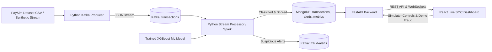

# Real-Time Financial Fraud Detection Pipeline

[](https://www.python.org/)
[](https://fastapi.tiangolo.com/)
[](https://reactjs.org/)
[](https://kafka.apache.org/)
[](https://www.mongodb.com/)
[](https://xgboost.readthedocs.io/)

A complete, production-grade real-time financial fraud detection pipeline built on the **PaySim synthetic mobile-money benchmark dataset**. Transactions stream continuously through Apache Kafka, are scored in real time by an imbalanced-optimized machine learning model (XGBoost / Random Forest), persisted to MongoDB, and monitored via a live SOC React dashboard over WebSockets.

---

## Architecture & Data Flow



---

## Key Features

1. **Streaming Data Ingestion**:
   - Python Kafka producer streaming PaySim transaction events.
   - Configurable throughput (1 to 50 TPS), dynamic pause/resume, and dataset replay.
2. **Machine Learning Fraud & Anomaly Detection**:
   - `XGBoost` classifier optimized with `scale_pos_weight` and PR-AUC loss for highly imbalanced fraud classes.
   - Feature engineering for ledger discrepancy detection (`errorBalanceOrig`, `errorBalanceDest`, `origBalanceDrainRatio`).
   - Comprehensive imbalanced metrics: Precision, Recall (Low False Negatives), F1-Score, ROC-AUC, PR-AUC, and Confusion Matrix.
   - Outputs: Fraud Classification, Risk Score ($0-100\%$), Risk Tier (`LOW`, `MEDIUM`, `HIGH`, `CRITICAL`), and Explainability Risk Factors.
3. **Dual Streaming Engines**:
   - **Primary Engine** (`streaming/stream_processor.py`): Lightweight, low-latency Python Kafka stream processor for normal student laptops.
   - **Enterprise Engine** (`streaming/spark_stream.py`): Apache Spark Structured Streaming with micro-batching.
4. **Database Persistence**:
   - MongoDB collections: `transactions`, `fraud_alerts`, `system_metrics`.
   - Unique indexing on `transaction_id` preventing duplicate records.
5. **FastAPI Backend & WebSockets**:
   - Full REST API with pagination, risk filters, and time ranges.
   - Real-time WebSocket broadcasting transactions and alerts to UI.
6. **Live React Dashboard**:
   - Top KPI Cards (Total Transactions, Fraud Detected, Fraud Rate, High/Critical count, Avg Latency).
   - Animated Live Transaction Feed with risk badges, latency, and masked accounts.
   - Active Fraud Alert Panel with analyst workflow status (`NEW`, `INVESTIGATING`, `CONFIRMED`, `DISMISSED`).
   - Deep Forensic Investigation Modal with ledger flow comparison and explainability factors.
   - Recharts Visualizations: Fraud vs Normal Donut, Time-Series Area, Risk Distribution Bar, Transaction Type Breakdown.
   - ML Model Diagnostics with interactive Confusion Matrix and Feature Importances.
   - Live Simulator Controls + "Inject Demo Fraud" trigger.

---

## Quick Start (Docker Compose)

The easiest way to run the entire pipeline with all infrastructure:

```bash
docker compose up --build
```

- **React Dashboard**: [http://localhost:3000](http://localhost:3000)
- **FastAPI API Documentation**: [http://localhost:8000/docs](http://localhost:8000/docs)
- **Kafka Broker**: `localhost:9092`
- **MongoDB**: `localhost:27017`

---

## Local Development Setup (Without Docker)

### 1. Prerequisites
- Python 3.10+
- Node.js 18+ and npm
- Apache Kafka & MongoDB running locally

### 2. Install Python Dependencies
```bash
pip install -r requirements.txt
```

### 3. Generate Sample Data & Train Model
```bash
# 1. (Optional) Generate PaySim-compatible synthetic demo data (if raw PaySim is not yet downloaded)
python scripts/generate_sample_data.py --rows 30000

# 2. Train the XGBoost fraud detection model
python ml/train.py
```

### 4. Start the Services

**Terminal 1: Start Stream Processor**
```bash
python -m streaming.stream_processor
```

**Terminal 2: Start FastAPI Backend**
```bash
python -m uvicorn backend.app.main:app --port 8000 --reload
```

**Terminal 3: Start React Frontend**
```bash
cd frontend
npm install
npm run dev
```

**Terminal 4: Start Kafka Transaction Producer (Optional or use Dashboard Start)**
```bash
python -m producer.producer --rate 5.0
```

---

## PaySim Dataset Setup

You can use either:
1. **Real PaySim Dataset**: Download `PS_20174392719_1491204439457_log.csv` from Kaggle and place it in the `data/` directory.
2. **Built-in Synthetic Generator**: Run `python scripts/generate_sample_data.py` to create `data/sample_transactions.csv` (clearly labeled as *"PaySim-compatible synthetic demo data"*).

### Schema:
- `step`: Simulation hour ($1-744$)
- `type`: `CASH_IN`, `CASH_OUT`, `DEBIT`, `PAYMENT`, `TRANSFER`
- `amount`: Transaction amount in currency
- `nameOrig`: Origin account ID (masked in UI: `C1***7890`)
- `oldbalanceOrg`: Initial balance of origin account
- `newbalanceOrig`: Balance of origin account after transaction
- `nameDest`: Destination account ID (masked in UI: `M9***3210`)
- `oldbalanceDest`: Initial balance of recipient account
- `newbalanceDest`: Final balance of recipient account
- `isFraud`: Binary fraud label ($0$ or $1$)
- `isFlaggedFraud`: Illegal transfer flag ($>200,000$)

---

## REST API Reference

| Method | Endpoint | Description |
|---|---|---|
| `GET` | `/api/health` | Service health (Kafka, MongoDB, ML status) |
| `GET` | `/api/stats` | Real-time aggregated KPI summary metrics |
| `GET` | `/api/transactions` | Paginated transactions with risk & type filtering |
| `GET` | `/api/transactions/recent` | Recent transactions buffer |
| `GET` | `/api/transactions/{id}` | Single transaction details |
| `GET` | `/api/fraud-alerts` | Filterable active fraud alerts |
| `PATCH` | `/api/fraud-alerts/{id}/status` | Update alert status (`NEW`, `INVESTIGATING`, etc.) |
| `GET` | `/api/analytics/timeseries` | Temporal volume and fraud rate data points |
| `GET` | `/api/analytics/distributions` | Risk level, type, and fraud vs normal counts |
| `GET` | `/api/model-info` | ML model metadata, metrics & feature importances |
| `GET` | `/api/simulator/status` | Streaming status, rate, and total sent counts |
| `POST` | `/api/simulator/control` | Control streaming (start, stop, pause, set_rate) |
| `POST` | `/api/simulator/inject-fraud`| Injects suspicious transaction into Kafka stream |
| `WS` | `/ws/live` | WebSocket endpoint for real-time live events |

---

## Running Automated Tests

```bash
pytest -v
```

Tests cover:
- Account ID masking and privacy protection.
- PaySim feature extraction & balance discrepancy math.
- XGBoost inference, threshold categorization, and explainability factors.
- FastAPI REST endpoints, status codes, and JSON responses.
- End-to-end stream processor message handling.

---

## Documentation & Viva Resources

- [Comprehensive Project Review & Viva Guide](PROJECT_REVIEW_DOCUMENTATION.md) — 14-section review documentation with viva Q&A, elevator pitches, and 5-minute demo scripts.
- [System Architecture](docs/architecture.md) — Architectural diagrams, stateful profiler specs, and Kafka event topology.
- [Live Demonstration Guide](docs/demo-guide.md) — Step-by-step evaluator presentation guide.
- [Implementation & Benchmark Report](IMPLEMENTATION_REPORT.md) — 4-model benchmark matrix (XGBoost, Random Forest, Isolation Forest, Autoencoder).

