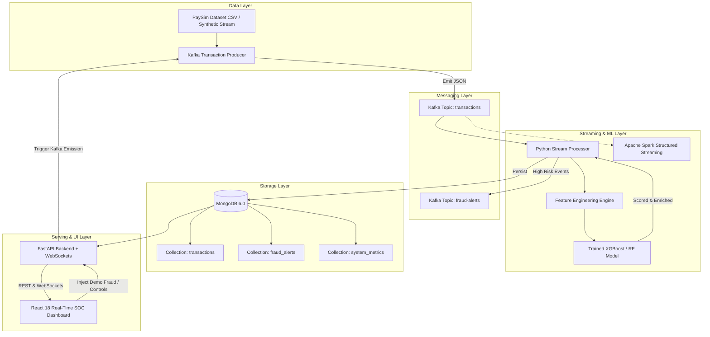

# System Architecture & Technical Specifications

## 1. Overview
The Real-Time Financial Fraud Detection Pipeline is designed for sub-second anomaly detection and high-throughput streaming analysis of financial transactions based on the PaySim mobile-money benchmark dataset.

---

## 2. Core Architecture Diagram

---

## 3. Component Details

### A. Kafka Transaction Producer (`producer/producer.py`)
- Continuously streams transactions at configurable speed (`TRANSACTION_RATE` TPS).
- Features dynamic speed control, dataset looping/replay, and synthetic demo fraud injection directly to topic `transactions`.
- Safely formats ISO timestamps and tracking identifiers (`transaction_id`).

### B. Machine Learning Engine (`ml/`)
- **Model**: `XGBClassifier` with `scale_pos_weight` class imbalance balancing and `aucpr` loss function.
- **Domain Features**:
  - `errorBalanceOrig`: $newbalanceOrig + amount - oldbalanceOrg$
  - `errorBalanceDest`: $oldbalanceDest + amount - newbalanceDest$
  - `origBalanceDrainRatio`: $\frac{amount}{oldbalanceOrg + 1.0}$
  - `destBalanceChangeRatio`: $\frac{|newbalanceDest - oldbalanceDest|}{amount + 1.0}$
  - `is_merchant_dest`, `is_transfer_or_cashout`, `hour_of_day`
- **Output Metrics**: Precision, Recall, F1, ROC-AUC, PR-AUC, Confusion Matrix.
- **Scoring Output**: Risk Score ($0-100\%$), Risk Tier (`LOW`, `MEDIUM`, `HIGH`, `CRITICAL`), and Explainability Risk Factors.

### C. Streaming Ingestion (`streaming/`)
- **Primary Engine** (`streaming/stream_processor.py`): Zero-JVM lightweight Kafka consumer with real-time ML scoring, microsecond latency tracking, MongoDB upserting, and Kafka alert routing.
- **Enterprise Engine** (`streaming/spark_stream.py`): Spark Structured Streaming implementation supporting cluster micro-batching.

### D. MongoDB Storage
- `transactions`: Stores all enriched transactions with unique indexing on `transaction_id`, evaluated timestamp, and risk tier.
- `fraud_alerts`: Stores high/critical risk and suspicious events with analyst workflow status (`NEW`, `INVESTIGATING`, `CONFIRMED`, `DISMISSED`).
- `system_metrics`: Stores rolling latency and throughput telemetry.

### E. FastAPI Backend (`backend/app/`)
- Asynchronous connection pooling via Motor.
- WebSockets broadcaster pushing live stream events and KPI deltas.
- REST endpoints supporting pagination, search, risk filtering, and simulation management.

### F. React Frontend Dashboard (`frontend/`)
- Live SOC-grade Dark Theme UI.
- Top KPI cards, animated transaction sliding feed, active alerts investigation modal, Recharts analytics, and ML performance metrics.
